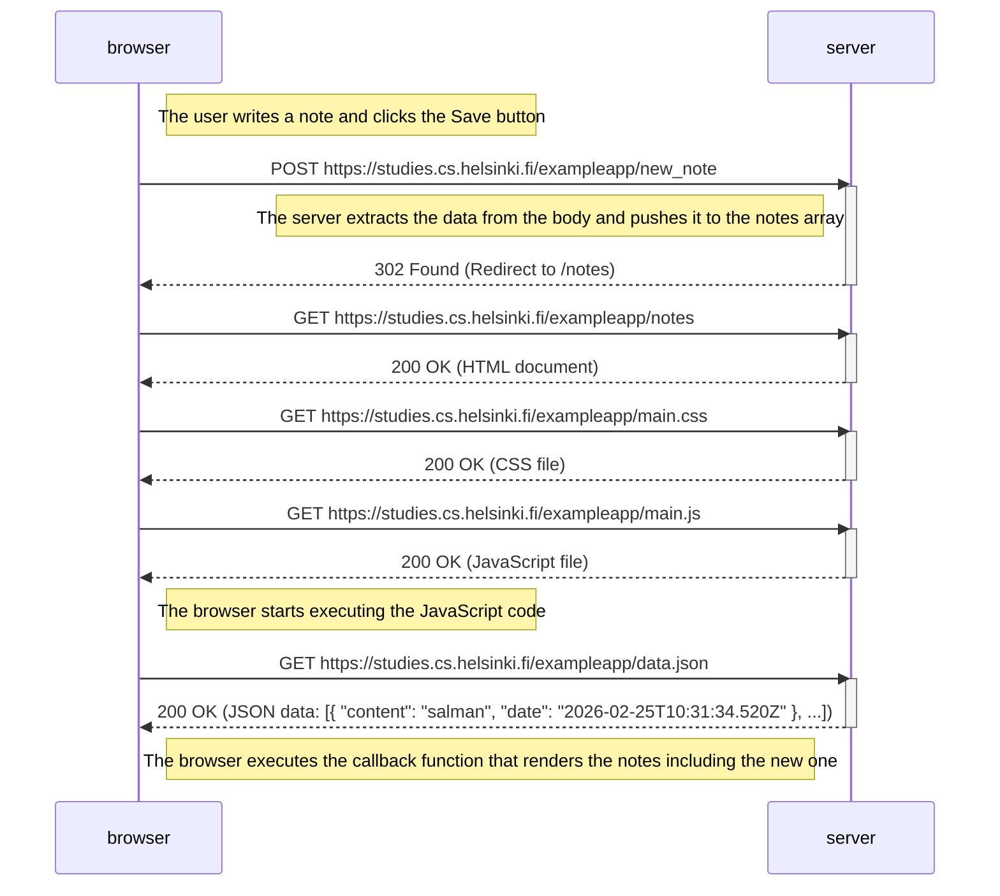
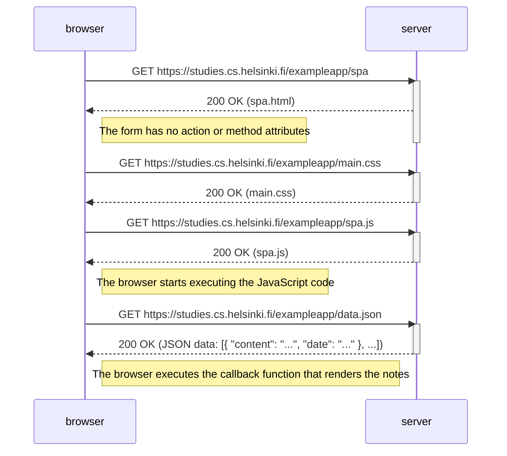
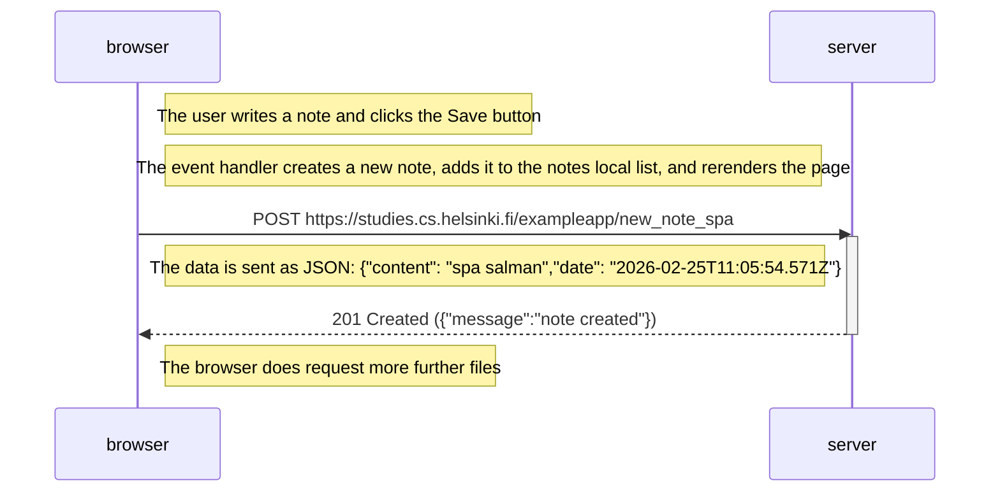

# 0.4: New note diagram

```mermaid
sequenceDiagram
    participant browser
    participant server

    Note right of browser: The user writes a note and clicks the Save button

    browser->>server: POST https://studies.cs.helsinki.fi/exampleapp/new_note
    activate server
    Note left of server: The server extracts the data from the body and pushes it to the notes array
    server-->>browser: 302 Found (Redirect to /notes)
    deactivate server

    browser->>server: GET https://studies.cs.helsinki.fi/exampleapp/notes
    activate server
    server-->>browser: 200 OK (HTML document)
    deactivate server

    browser->>server: GET https://studies.cs.helsinki.fi/exampleapp/main.css
    activate server
    server-->>browser: 200 OK (CSS file)
    deactivate server

    browser->>server: GET https://studies.cs.helsinki.fi/exampleapp/main.js
    activate server
    server-->>browser: 200 OK (JavaScript file)
    deactivate server

    Note right of browser: The browser starts executing the JavaScript code

    browser->>server: GET https://studies.cs.helsinki.fi/exampleapp/data.json
    activate server
    server-->>browser: 200 OK (JSON data: [{ "content": "salman", "date": "2026-02-25T10:31:34.520Z" }, ...])
    deactivate server

    Note right of browser: The browser executes the callback function that renders the notes including the new one
```
---

# 0.5: Single Page App

```mermaid
sequenceDiagram
    participant browser
    participant server

    browser->>server: GET https://studies.cs.helsinki.fi/exampleapp/spa
    activate server
    server-->>browser: 200 OK (spa.html)
    Note right of browser: The form has no action or method attributes

    deactivate server

    browser->>server: GET https://studies.cs.helsinki.fi/exampleapp/main.css
    activate server
    server-->>browser: 200 OK (main.css)
    deactivate server

    browser->>server: GET https://studies.cs.helsinki.fi/exampleapp/spa.js
    activate server
    server-->>browser: 200 OK (spa.js)
    deactivate server

    Note right of browser: The browser starts executing the JavaScript code

    browser->>server: GET https://studies.cs.helsinki.fi/exampleapp/data.json
    activate server
    server-->>browser: 200 OK (JSON data: [{ "content": "...", "date": "..." }, ...])
    deactivate server

    Note right of browser: The browser executes the callback function that renders the notes
```

# 0.6: New note in Single page app diagram

```mermaid
sequenceDiagram
    participant browser
    participant server

    Note right of browser: The user writes a note and clicks the Save button

    Note right of browser: The event handler creates a new note, adds it to the notes local list, and rerenders the page
    
    browser->>server: POST https://studies.cs.helsinki.fi/exampleapp/new_note_spa
    activate server
    Note right of browser: The data is sent as JSON: {"content": "spa salman","date": "2026-02-25T11:05:54.571Z"}
    server-->>browser: 201 Created ({"message":"note created"})
    deactivate server

    Note right of browser: The browser does request more further files
```